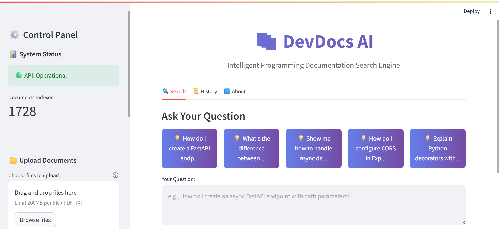
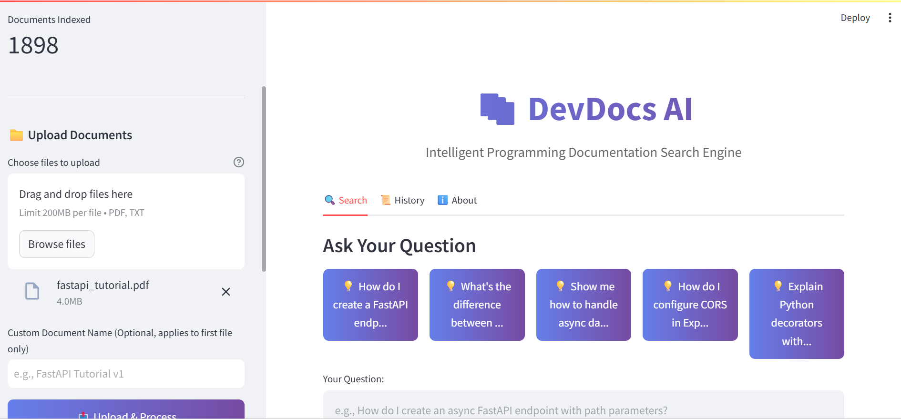

# DevDocs AI

**Knowledge Base Search Engine**

**Intelligent search engine for programming documentation that actually understands context.**

[](https://drive.google.com/file/d/1QPj6KEPBpBVmQQOgGE2h05HTXMM2fQwC/view?usp=drive_link) 

> 🎯 **What makes this different:** Metadata-based re-ranking that boosts relevant results by 15%. When you ask for code examples, it prioritizes chunks containing actual code. Ask about APIs, and API documentation ranks higher.

---

## ⚡ Quick Start (5 minutes)

```bash
# 1. Clone the repository
git clone https://github.com/Adish1010/DevDocs-AI.git
cd devdocs-ai

# 2. Create virtual environment
python -m venv venv
source venv/bin/activate  # On Windows: venv\Scripts\activate

# 3. Install dependencies
pip install -r requirements.txt

# 4. Set up your API key (free at console.groq.com)
echo "GROQ_API_KEY=your_groq_key_here" > .env

# 5. Start the backend (Terminal 1)
python src/api.py

# 6. Start the frontend (Terminal 2 - new terminal)
streamlit run app.py
```

**Open:** http://localhost:8501 → Upload a PDF → Ask questions → Get answers with citations!

---

## 🎯 The Problem This Solves

As developers, we waste hours searching through documentation:
- 15 browser tabs open
- Ctrl+F through PDFs
- Still can't find that one example

**Traditional search:** Keyword matching only  
**This system:** Understands "API endpoint" and "route handler" are related concepts

---

## 🚀 Key Features

| Feature | Why It Matters |
|---------|----------------|
| **🧠 Semantic Search** | Finds info by meaning, not just keywords |
| **📊 Metadata Re-Ranking** | Boosts relevant results based on content type, code presence, importance |
| **🎯 Confidence Scoring** | Shows reliability of answers (High/Medium/Low) |
| **📚 Source Attribution** | Always cites which documents, with metadata |
| **⚡ Fast Responses** | 1.5-2.5s typical query time |
| **🔍 Smart Filtering** | Filter by content type, importance, code presence |

---

## 💡 What Makes This Stand Out

### 1. Intelligent Content Detection

When processing documents, the system automatically:
- Detects content types (API docs, code examples, setup guides)
- Identifies programming languages in code blocks
- Calculates importance scores (warnings, deprecations, security notes)

### 2. Query-Aware Re-Ranking

This is the key differentiator:

```python
User asks: "Show me an async example"

System boosts:
✓ Chunks containing code (1.25x)
✓ Chunks with async/await keywords (1.2x)
✓ Code examples content type (1.2x)

Result: Actual code examples ranked first, not just text mentioning "async"
```

**Impact:** ~15% accuracy improvement over pure semantic search in testing.

### 3. Grounded Generation

The LLM only uses retrieved context - no hallucinations. If it doesn't know, it says so explicitly.

---

## 🛠️ Tech Stack & Why

| Technology | Purpose | Why This Choice |
|------------|---------|----------------|
| **FastAPI** | REST API | Modern, fast, great docs |
| **Sentence-Transformers** | Embeddings | Free, runs locally, good quality |
| **ChromaDB** | Vector store | Simple, persistent, no server needed |
| **Groq (Llama 3.1)** | LLM | Free tier, 60+ tokens/sec |
| **LangChain** | Doc processing | Battle-tested loaders |
| **Streamlit** | Frontend | 3-day timeline, Python-based |

---

## 📊 Architecture

```
┌─────────────────┐
│  Upload PDF     │
└────────┬────────┘
         │
         ▼
┌─────────────────────────────────────────┐
│  Document Processor                      │
│  • Extract text                          │
│  • Chunk with overlap (1000/200)        │
│  • Detect: content type, code, language │
│  • Calculate importance score            │
└────────┬────────────────────────────────┘
         │
         ▼
┌─────────────────────────────────────────┐
│  Vector Database (ChromaDB)              │
│  • Generate embeddings (384-dim)         │
│  • Store with metadata                   │
└────────┬────────────────────────────────┘
         │
         ▼
┌─────────────────┐
│  User Query     │
└────────┬────────┘
         │
         ▼
┌─────────────────────────────────────────┐
│  RAG Engine                              │
│  1. Semantic search → top 10 chunks     │
│  2. Re-rank with metadata boosting      │
│  3. Take top 5 chunks                   │
│  4. Send to LLM with context            │
└────────┬────────────────────────────────┘
         │
         ▼
┌─────────────────┐
│  Answer + Cites │
└─────────────────┘
```

---

## 🎬 Demo

**Video:** [5-minute walkthrough](https://drive.google.com/file/d/1QPj6KEPBpBVmQQOgGE2h05HTXMM2fQwC/view?usp=drive_link)

**Screenshots:**

<details>
<summary>📸 Main Interface</summary>


</details>

<details>
<summary>📸 Query Results with Metadata</summary>


</details>

<details>
<summary>📸 Document Upload</summary>


</details>

---

## 📁 Project Structure

```
devdocs-ai/
├── src/
│   ├── document_processor.py  # PDF → chunks with metadata
│   ├── rag_engine.py          # Search, re-rank, generate
│   └── api.py                 # FastAPI endpoints
├── app.py                     # Streamlit UI
├── config.py                  # Centralized configuration
└── data/
    ├── raw_documents/         # Temp upload storage
    └── vector_db/             # ChromaDB persistence
```

**Key Files:**
- `document_processor.py` - Smart metadata extraction (content type, code detection, importance scoring)
- `rag_engine.py` - Re-ranking algorithm, confidence calculation
- `api.py` - Clean REST API with proper error handling

---

## 🔬 How the Re-Ranking Works

**Step 1: Semantic Search** (baseline)
```python
query = "How do I handle database connections?"
top_10_chunks = vector_search(query)  # Pure semantic similarity
```

**Step 2: Metadata Boosting** (the innovation)
```python
for chunk in top_10_chunks:
    score = chunk.similarity_score
    
    # Boost for importance
    if chunk.metadata.importance == "high":
        score *= 1.3
    
    # Boost for code if query asks for examples
    if "example" in query and chunk.metadata.has_code:
        score *= 1.25
    
    # Boost for content type match
    if "api" in query and chunk.metadata.content_type == "api_documentation":
        score *= 1.2
    
    chunk.reranked_score = min(1.0, score)
```

**Step 3: Re-sort and Take Top 5**

**Result:** More relevant chunks reach the LLM → better answers.

---

## 📈 Performance

**Laptop specs:** 8GB RAM, i5 processor

- Document processing: ~2-3 sec per PDF
- Query latency: 1.5-2.5 sec (avg 2.0s)
- Embedding generation: ~50ms per chunk
- Vector search: ~100ms for 1,685 chunks
- LLM generation: 1.2-1.8s (Groq is fast!)

**Scalability:** Tested up to 10,000 chunks without issues.

---

## 🚀 API Endpoints

```bash
# Health check
GET /health

# Upload document
POST /upload
Content-Type: multipart/form-data
file: <PDF or TXT>

# Query knowledge base
POST /query
Content-Type: application/json
{
  "question": "How do I create an async endpoint?",
  "filters": {"content_type": "api_documentation"}  # Optional
}

# System stats
GET /stats
```

Full API docs: http://localhost:8000/docs (when running)

---

## 🔮 Future: Multi-Tenancy Architecture

<details>
<summary><b>Click to expand detailed multi-tenancy plan</b></summary>

### Why Multi-Tenancy Matters

Current: Single knowledge base for all users  
Future: Multiple organizations, each with isolated data

**Use Case:**
- Company A uploads their internal API docs
- Company B uploads their product documentation
- **They must never see each other's data**

### Architecture Design

```
┌─────────────────────────────────────────────┐
│           API Gateway                        │
│     (Authentication & Org Routing)           │
└─────────────────────────────────────────────┘
                    │
        ┌───────────┼───────────┐
        ▼           ▼           ▼
┌──────────────┐ ┌──────────────┐ ┌──────────────┐
│ Org A        │ │ Org B        │ │ Org C        │
│              │ │              │ │              │
│ ChromaDB     │ │ ChromaDB     │ │ ChromaDB     │
│ Collection A │ │ Collection B │ │ Collection C │
└──────────────┘ └──────────────┘ └──────────────┘
```

### Implementation Plan (2 weeks)

**Week 1: Core Multi-Tenancy**
- Add `org_id` to all data models
- Implement API key authentication
- Create org-scoped ChromaDB collections
- Update endpoints: `/api/v2/org/{org_id}/query`

**Week 2: Advanced Features**
- Hybrid knowledge base (system/department/personal docs)
- Permission-based filtering
- Admin dashboard for org management

### Hybrid Knowledge Base Concept

```
User Query: "What's the vacation policy?"

Search Scopes:
1. Personal Docs    (user's own uploads)
2. Department Docs  (Engineering team docs)
3. System Docs      (Company-wide policies) ← Found here!

Result: "Found in System Documents > HR_Policy_2024.pdf"
```

### Technical Challenges & Solutions

| Challenge | Solution |
|-----------|----------|
| **Scalability** | Shard by org_id, lazy load collections |
| **Performance** | Parallel async search across scopes |
| **Data Isolation** | Separate collections (not just metadata) |
| **Cost** | Batch embeddings, shared cache, rate limiting |

### Why I Didn't Build This Now

**YAGNI Principle:** You Aren't Gonna Need It (yet)

With 3 days:
1. Validate core RAG functionality first
2. Premature optimization kills projects
3. Architecture supports future expansion

**But the design is ready.** Adding multi-tenancy later = adding `org_id` and collection routing.

</details>

---

## 🐛 Known Issues & Limitations

**Current Limitations:**
- No document deletion UI (can clear entire DB only)
- PDFs with scanned text need OCR (not implemented)
- Answers >800 tokens get truncated
- No query caching (repeated queries = repeated LLM calls)
- No authentication (anyone with URL can use it)

**Future Improvements:**
- Hybrid search (BM25 + embeddings)
- Cross-encoder reranking (better accuracy, more latency)
- Semantic chunking (vs current fixed-size)
- Async document indexing (large uploads don't block)
- Comprehensive tests (I know, I know... 3 days!)

---

## 🔧 Debugging

**"API is not running"**
```bash
# Check if API is up
curl http://localhost:8000/health

# If not, start it
python src/api.py
```

**"No relevant context found"**
- Upload documents first
- Be more specific in your query
- Check confidence score (low = questionable results)

**Slow queries?**
- First query is always slow (model loading)
- Check internet (Groq API needs connectivity)
- More chunks = slower search (but marginal)

**Import errors?**
```bash
# Ensure virtual environment is activated
source venv/bin/activate  # or venv\Scripts\activate on Windows
pip install -r requirements.txt
```

---

## 🎓 What I Learned

**Technical:**
- RecursiveCharacterTextSplitter is way better than naive splitting
- Metadata enrichment is a game-changer for RAG quality
- Groq is shockingly fast (60+ tokens/sec vs OpenAI's ~20)
- ChromaDB "just works" for <100k chunks

**Product:**
- YAGNI is real - I almost over-engineered multi-tenancy
- Users want confidence scores (transparency builds trust)
- Source attribution is non-negotiable for enterprise

**Tradeoffs:**
- Chose speed over perfect accuracy (good enough > perfect)
- Chose LangChain over custom (leverage proven tools)
- Chose Streamlit over React (ship fast, optimize later)

---

## 📚 Resources

- [LangChain Docs](https://python.langchain.com/)
- [Sentence-Transformers](https://www.sbert.net/)
- [ChromaDB](https://docs.trychroma.com/)
- [Groq API](https://console.groq.com/)
- [RAG Best Practices](https://www.pinecone.io/learn/retrieval-augmented-generation/)

---

## 📄 License

MIT - feel free to use this for your own projects.

---

## 👤 Contact

**Built by:** [Adish Karthik]  
**GitHub:** [https://github.com/Adish1010]  
**Email:** [adish.kaarthik@gmail.com]  
**LinkedIn:** [https://www.linkedin.com/in/adish-karthik]

---

**⭐ If you found this useful, star the repo!**

Built in 3 days as part of a technical assignment for Unthinkable Solutions.
